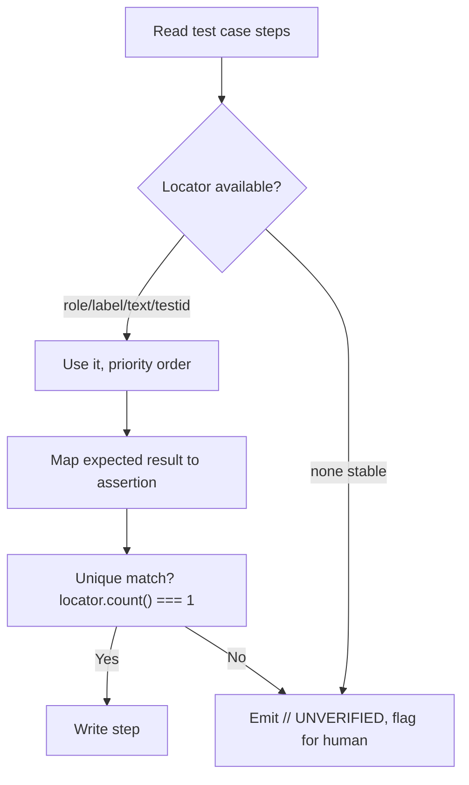

## When this fires

- "Automate TC-014"
- Any case from `test-case-writer` tagged `Automation candidate: yes`
- "Write a Playwright script for the expired-reset-link scenario"

## Workflow

1. **Confirm automatability.** If the case has a subjective/visual-judgment step ("looks correct"), stop and say so — don't force it into an assertion that doesn't actually check anything.
2. **Map each numbered step to Playwright actions**, using `template/playwright.spec.template.ts` as the skeleton.
3. **Pick locators by priority** — this is the part that keeps generated scripts from rotting:
   `getByRole` → `getByLabel` → `getByText` → `getByTestId` → scoped CSS (last resort, and only when scoped to a stable parent, never a bare `nth-child`/index).
4. **Map each expected result to an assertion** (`expect(...).toBeVisible()`, `toHaveText()`, etc.) — one assertion per expected result in the case, not one giant assertion at the end.
5. **Flag unverifiable locators.** If a required element has no accessible role/label/test-id in the DOM the agent inspected, emit the step as `// UNVERIFIED: <reason>` instead of guessing a selector — a wrong selector that happens to pass once is worse than an honest gap.

## Output contract

A single `.spec.ts` file per test case, named `<TC-ID>.spec.ts`, following the template — imports, one `test(...)` block per case, comments linking back to the TC ID and its source AC.

## Guardrails

| Rule | Why |
|---|---|
| Never use `nth-child`, `.nth()`, or raw index selectors | The #1 cause of flaky suites; breaks silently on any DOM reorder |
| Never fabricate a `data-testid` that doesn't exist in the inspected DOM | A script that can't find its own locator isn't automation, it's a stub |
| One assertion per expected result in the source case | Keeps failures traceable to the exact step that broke |
| Flag subjective steps instead of forcing a brittle assertion | A false-passing visual check is worse than no automation |
