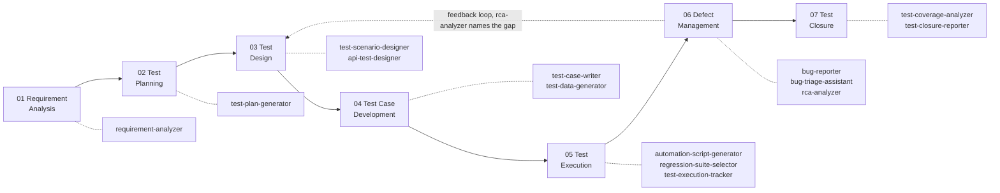

# STLC Skill Pack

AI agent skills for the full software testing lifecycle — requirement analysis through test closure — as a companion to the QA Studio app in the rest of this repo. Where QA Studio is a workspace *you* use to author test plans and bug reports, this pack is instructions an *agent* follows to draft the same kinds of artifacts inside your editor or terminal.

## Roadmap



`rca-analyzer` closes the loop back into test design — every root-cause analysis names which earlier phase should have caught the bug, so the pack accumulates coverage over time instead of staying static.

## Skills

| Phase | Skill | One-liner |
|---|---|---|
| 01 Requirement Analysis | [`requirement-analyzer`](01-requirement-analysis/requirement-analyzer/SKILL.md) | Scores a ticket against a 5-dimension readiness checklist, surfaces gaps |
| 02 Test Planning | [`test-plan-generator`](02-test-planning/test-plan-generator/SKILL.md) | Ticket → review-ready test plan (flagship) |
| 03 Test Design | [`test-scenario-designer`](03-test-design/test-scenario-designer/SKILL.md) | ACs → positive/negative/boundary/cross-role scenarios, risk-tagged |
| 03 Test Design | [`api-test-designer`](03-test-design/api-test-designer/SKILL.md) | Endpoint/contract → coverage matrix with expected status codes |
| 04 Test Case Development | [`test-case-writer`](04-test-case-development/test-case-writer/SKILL.md) | Approved scenarios → step-by-step executable cases |
| 04 Test Case Development | [`test-data-generator`](04-test-case-development/test-data-generator/SKILL.md) | Real script — valid/invalid/boundary/synthetic data per field |
| 05 Test Execution | [`automation-script-generator`](05-test-execution/automation-script-generator/SKILL.md) | Test case → real Playwright script, resilient locator priority |
| 05 Test Execution | [`regression-suite-selector`](05-test-execution/regression-suite-selector/SKILL.md) | Change description → risk-ranked regression subset |
| 05 Test Execution | [`test-execution-tracker`](05-test-execution/test-execution-tracker/SKILL.md) | Real script — logs results, rolls up completion %/pass rate |
| 06 Defect Management | [`bug-reporter`](06-defect-management/bug-reporter/SKILL.md) | Failure → structured bug report, fields match QA Studio's own bug shape |
| 06 Defect Management | [`bug-triage-assistant`](06-defect-management/bug-triage-assistant/SKILL.md) | Backlog → duplicates flagged, severity proposed, routed |
| 06 Defect Management | [`rca-analyzer`](06-defect-management/rca-analyzer/SKILL.md) | 5-Whys + fishbone + CAPA, names the missed STLC phase |
| 07 Test Closure | [`test-coverage-analyzer`](07-test-closure/test-coverage-analyzer/SKILL.md) | Requirements × tests traceability, surfaces untested/under-tested ACs |
| 07 Test Closure | [`test-closure-reporter`](07-test-closure/test-closure-reporter/SKILL.md) | Cycle metrics → closure report, advisory go/no-go |

## What's different from a single mega-prompt

- **One skill per STLC activity**, each a `SKILL.md` with a routing description, workflow, output contract, and guardrails — so any agent produces the same artifact shape every time, and picking the right skill is a description match, not a manual instruction every time.
- **Real integrations, not stubs.** [`_shared/trackers/`](_shared/trackers/README.md) has working Jira, GitHub Issues, and Linear scripts — fetch, create, comment — auth'd from environment variables, never hardcoded.
- **Automation-first depth in 04–07.** `test-data-generator` and `test-execution-tracker` are real, runnable Python scripts, not prompt descriptions of what a script would do; `automation-script-generator` emits an actual Playwright spec with a resilient-locator priority order, not a skeleton.
- **Multi-agent by generation, not duplication.** `SKILL.md` is Claude Code/Cline's native format already. [`_shared/adapters/generate_adapter.py`](_shared/adapters/README.md) mechanically derives Copilot/Cursor/Windsurf formats from the same source file — no hand-maintained near-duplicate copies per tool.

## Guardrails, pack-wide

Every skill in this pack stops at a human review gate somewhere — drafts, suggests, and scores, but never marks anything `Approved`, `Final`, or auto-files/auto-merges on its own. See each `SKILL.md`'s own guardrails table for specifics.

## Using a skill

**Claude Code / Cline** — these read `SKILL.md` natively. Point the agent at a skill's directory, or just describe the task ("create a test plan for PROJ-49") and the routing `description` in each skill's frontmatter does the matching.

**GitHub Copilot / Cursor / Windsurf** — generate that agent's native file once:
```bash
python3 skills/_shared/adapters/generate_adapter.py skills/02-test-planning/test-plan-generator/SKILL.md
```
See [`_shared/adapters/README.md`](_shared/adapters/README.md) for the full mapping and a batch-regenerate command.

## Tracker setup

See [`_shared/trackers/README.md`](_shared/trackers/README.md) for Jira/GitHub/Linear environment variables and setup.
